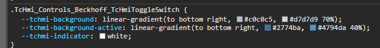

# Simple example of changing component styles in TwinCAT HMI

## Disclaimer

This is a personal guide not a peer reviewed journal or a sponsored publication. We make
no representations as to accuracy, completeness, correctness, suitability, or validity of any
information and will not be liable for any errors, omissions, or delays in this information or any
losses injuries, or damages arising from its display or use. All information is provided on an as
is basis. It is the reader’s responsibility to verify their own facts.

The views and opinions expressed in this guide are those of the authors and do not
necessarily reflect the official policy or position of any other agency, organization, employer or
company. Assumptions made in the analysis are not reflective of the position of any entity
other than the author(s) and, since we are critically thinking human beings, these views are
always subject to change, revision, and rethinking at any time. Please do not hold us to them
in perpetuity.

## Overview

TwinCAT HMI controls will often expose styles via the properties window. However, in some applications you may want to change styles which are not available in this way. This walkthrough will show you how to change the background color of a toggle switch. The same methods can be applied to all controls.

## Guide

First you need to find out what CSS is controlling the style you wish to change. I find the easiest way to do this is by opening the live view in Chrome, right clicking and selecting Inspect.

You should then see a Styles tab on the right-hand side.

This is the slightly tricky part. You will now look down the list of styles and try to identify the style which is applying the color you wish to change.

In this example, we can see a style which is prime candidate for checking.

We can see that it has a grey-ish gradient when not active, and an active of blue, which we know to be the colors of the toggle.

Click the color boxes in chrome and make the changes to see if this changes the control style you need.

Had the following result.

Once we are happy with our style we need to add this to our TwinCAT HMI project.

First copy your style directly from Chrome.

Next, locate the base style css. You will also need to do the Base-Dark in the same way if you are supporting dark themes.

Paste the style at the bottom.

You will now see the editor update, even in design view.

If you do not want to change all toggles to the same style, then you can instead link the style to a new class. Without this, all labels will become the new style.

Adding a class is only a few extra steps. Find Base.theme, and right click Control Classes > Create new Control Class.

Give it a name which relates to the style.

Next, select the toggle that you wish to have the new styling. Select properties > Common > ClassNames and Move the class name in to the added items.

Once done press enter.

Lastly, go back to the CSS and add .tchmi-class-BrightToggle to the start of the css selector. Make sure this is attached to the front of the line, with no spaces.

Once saved your style will now only target toggles which have the BrightToggle class attached to them.

## Need more help?

Please visit http://beckhoff.com/ for further guides
